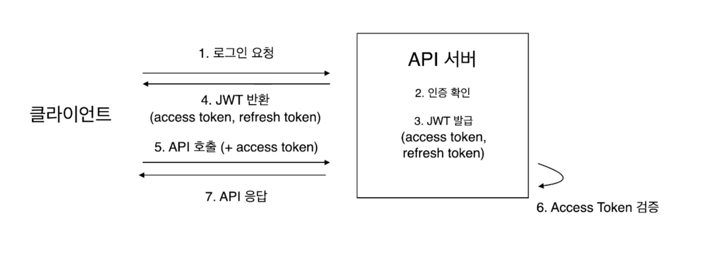
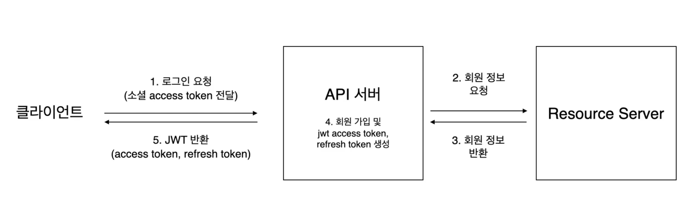
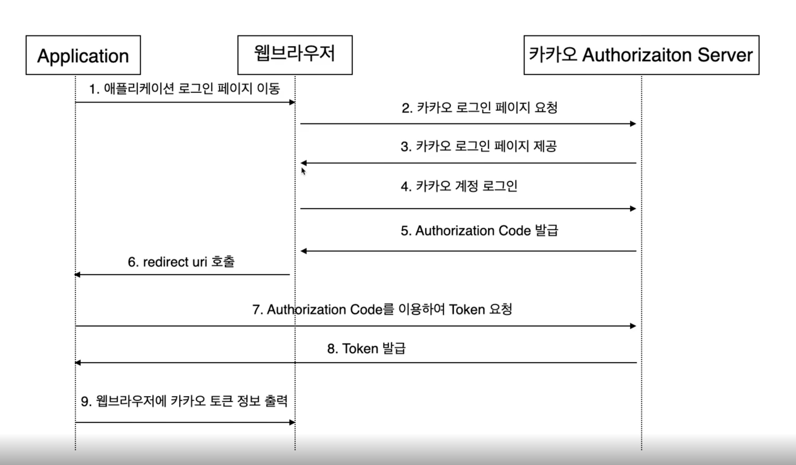

### 패키지 구조 설계
api 패키지와 domain 패키지 설계 시 중요점  
- domain 패키지에서는 api 패키지에 의존하지 않아야 한다.
  - api요청을 받는 dto를 domain 패키지에서 사용하지않고 엔티티 클래스로 대신 받는다.
  - 이렇게 되면 핵심 비지니스 로직을 가지고있는 도메인 패키지는 그대로 활용이 가능하다.
  - msa 시 도메인 패키지에 있는 로직은 특정 api의 dto에 종속되지 않으므로 그대로 활용가능

### 서버 상태 체크 api 구현
- 애플리케이션이 정상적으로 동작하고 있는지를 확인하기 위한 health check용 api
- url : localhost:8080/api/health
- 반환결과: {"health":"ok","activeProfiles":["dev"]}

### WebConfig CORS 설정
- SOP(Same Origin Policy) : 어떤 출처에서 다른 출처의 리소스를 사용하는 것을 제한하는 보안 방식
- Origin Example : http://localhost:8082(프로토콜 + 호스트 + 포트)
- ex) http://localhost:8082에서 http://localhost:8080/api/health 호출 시 다른 Origin 이므로 브라우저에서 에러 발생  
 
- CORS(Cross-Origin Resource Sharing) : 다른 출처에서 리소스를 공유하는 것

### Preflight Request(사전 요청)
- 웹브라우저는 기본적으로 cross origin에 대해서 HTTP 요청 전에 서버 측에서 해당 요청을 보낼 수 있는지 확인하는 Preflight Request(사전 요청)을 보냄
- Preflight Request는 HTTP OPTIONS 메서드를 사용
- Preflight Request를 사용하는 이유는 CORS 오류는 웹브라우저에서 발생하기 때문에 서버에서는 정상적으로 요청을 처리했는데 클라이언트에서는 오류가 난 것처럼 보일 수 있기 때문에 Preflight Request를 이용하여 사전에 확인함

### Preflight Request 생략
- 모든 요청이 Preflight를 발생시키는 것은 아니고 아래 조건을 모두 만족하는 요청의 경우는 단순 요청(Simple Requests)이라고 하며 Preflight가 발생하지 않음
- HTTP Method : GET, HEAD, POST
- 수동으로 설정한 헤더가 다음인 경우 : "Accept", "Accept-Language", "Content-Language", "Content-Type"
- 단, Content-Type 헤더의 경우 "application/x-www-from-urlencoded", "multipart/form-data", "text/plain" 값들인 경우에만 Preflight가 발생하지 않음

### application.yml 설정
- yml 파일을 통해 프로젝트 설정 값을 관리
- application.yml : default 프로젝트 설정 값
- application-dev.yml : 개발 환경에서의 프로젝트 설정 값
- application-prod.yml : 운영 환경에서의 프로젝트 설정 값
- application-test.yml : 테스트 환경에서의 프로젝트 설정 값
- 실행하는 profile에 따라서 yml에 default로 설정해둔 값이 오버라이드 됨

### 에러 처리
- 클라이언트에서 예외처리를 동일하게 관리할 수 있도록 통일된 ErrorResponse 반환
- @ResetControllerAdvice : @RestController에서 전역적으로 발생하는 예외를 한 군데에서 처리
- 비즈니스 로직을 수행하다가 조건이 맞지 않을 경우 BusinessException 발생
- ErrorCode Enum을 이용하여 에러 메시지, 에러코드 및 반환할 http status 관리

### JPA Auditing
- Audit : 감시하다
- 엔티티가 저장 또는 수정될 때 생성일자, 수정일자, 생성자, 수정자 변경 시 자동으로 값을 넣어 주도록 설정
- @EnableJpaAuditing : JPA Auditing 기능을 사용하기 위한 어노테이션

### Spring Cloud OpenFeign
- 인터페이스와 Spring MVC 어노테이션 선언으로 http 호출이 가능한 빈 자동 생성
- RestTemplate 보다 코드를 더 쉽고 깔끔하게 작성 가능

### JWT란?
- JWT(Json Web Token) : json 포맷을 이ㅛㅇ하여 인증에 필요한 정보들을 암호화 시킨 토큰
- JWT 구성 요소는 각각 Base64로 인코딩

### JWT 장점
- 사용자 인증에 필요한 정보를 토큰에서 가지고 있기 때문에 별도의 저장소가 필요 없음
- 다수의 서버를 운영할 때 토큰을 만들 때 사용했던 시크릿 키만 공유되어 있으면 요청을 받은 서버에서 인증 처리 가능(인증 서버에 트래픽이 몰리는 문제 방지) 

### JWT 단점
- 토큰에 데이터를 많이 담을 수록 토큰의 길이가 길어져 네트워크 부하가 심해질 수 있음
- Payload에 대한 정보를 base64Url로 디코딩하면 데이터를 그대로 볼 수 있기 때문에 중요한 데이터는 Payload에 담으면 안됨

### JWT 발급 및 API 호출 과정

- accessToken : 인증을 위한 토큰
- refreshToken: 액세스 토큰이 만료되었을 때 재발급을 위해 사용하는 토큰
- 토큰의 만료시간 : accessToken < refreshToken

### 소셜 로그인 및 JWT 발급

### Authentication Interceptor
- 현재 요청하는 API에 대해서 인증 ㅔㅊ크
  - 토큰 전송 여부
  - 정상 토큰
  - Token Type
  - Access Token 만료 시간

### MemberInfoArgumentResolver
- access token에서 가지고 있는 유저의 정보를 컨트롤러 클래스 메서드의 파라미터로 받을 수 있도록 Argument Resolver 구현

1. @MemberInfo 어노테이션 생성
2. 회원 정보를 가지는 MemberInfoDTo 클래스 생성
3. MemberInfoArgumentResolver 로직 구현
4. WebConfig에 Argument Resolver 등록
5. 컨트롤러 클래스 메서드에 @MemberInfo 어노테이션 기반으로 회원 정보를 받아와서 사

### AdminAuthorizationInterceptor
- "/api/admin/**" path parttern으로 요청이 오는 경우 access token의 Role이 ADMIN Role 인지 검사

### yml 암호화
- yml 파일에 입력한 외부에 노출되서는 안되는 민감한 정보들은 암호화 적용
- ex) 데이터베이스 id/password, token secret key, kakao client id/password 등

**jasypt build.gradle 추가**
- jasypt : Java Simplified Encryption의 약자
- 개발자가 암호화에 대한 지식이 없어도 함호화 기능을 쉽게 사용할 수 있게 도와주는 라이브러리

**jasypt build.gradle 추가**
- PooledPBEStringEncryptor : 멀티코어 시스템에서 해독을 병렬 처리
- Pool size의 경우 머신의 코어수와 동일하게 설정하는게 좋음

### Swagger
- OAS(Open Api specification)을 위한 프레임워크
- API 문서화를 어노테이션을 이용하여 자동화 할 수 있게 도와줌
- Swagger 문서페이지에서 데이터를 직접 입력하고 API 응답 결과를 받아볼 수 있음
- Swagger 문서 경로 : http://localhost:8080/swagger-ui/index.html
- Swagger 관련 어노테이션 
  | 어노테이션 | 설명 |  
  | --- | --- |  
  | @Tag | API 그룹 설정 - name : 태그의 이름 - description : API 그룹에 대한 설명 |  
  | @Operation | API에 대한 설명 - summary : api에 대한 짧은 설명 - description : api에 대한 자세한 설명 |  
  | @Schema | 모델에 대한 정보 제공 - description: 필드에 대한 설명 - example: 예시 값 - required: 필수 여부(default false) |  
  | @ApiResponse | Api 호출 결과에 대해서 설명 - responseCode : 응답 코드 - description : 응답 코드에 대한 설명 복수개의 응답 지정(200, 500, http status code 등)을 지정할 경우 @ApiResponses 어노테이션 사용 |  
  | @Parameter | Api의 Request Parameter에 대한 설명 - name : 파라미터에 대한 이름 - description : 파라미터에 대한 설명 - required: 필수 여부 (default false) - in : 파라미터 위치(query, path, header, cookie) 복수개의 파라미터를 설명할 경우 @Parameters 어노테이션 사용 |  
